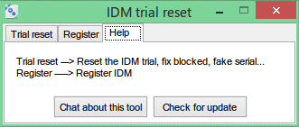

  

# Internet Download Manager for Windows

**Internet Download Manager (IDM)** is a Windows download management application designed to help users organize and manage file downloads. It supports downloading different types of files and provides a simple interface for managing downloads on Windows PCs.

## 🚀 Features

* 📥 Download management for Windows
* ⚡ Manage multiple downloads
* 📁 Organize downloaded files
* ⏯️ Download management controls
* 🖥️ Windows desktop support
* 📦 ZIP release package
* 🔗 Easy GitHub release download

## 📥 Download

Download the available release package from GitHub:

  

## 🔎 SEO Keywords

Internet Download Manager, IDM for Windows, IDM download manager, Windows download manager, download manager for PC, Internet download software, Windows file downloader, download management software, IDM Windows, PC download manager.

## 📌 Release Information

* **Version:** v1
* **Release Name:** IDM
* **Platform:** Windows
* **Package:** `Internet.Download.Manager.zip`

## ⚠️ License & Usage

This repository provides a release package for download. Please use the software according to its applicable license, copyright, and terms of use.
